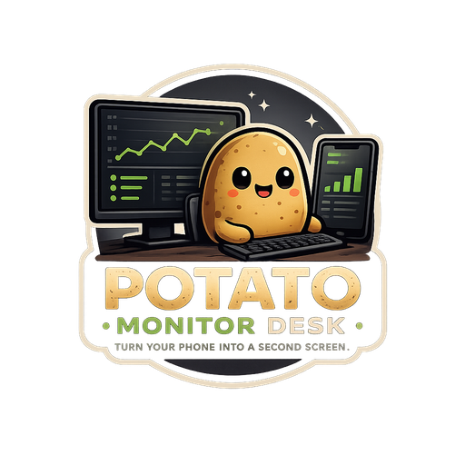

# Potato Monitor Desk



Preview layar + suara PC ke HP Android lewat kabel USB — versi ringan ala
spacedesk, tapi **tanpa driver display virtual** (bukan extend monitor asli,
melainkan mirror/preview layar PC ke HP dengan latensi rendah).

Server berjalan di **system tray** (bukan console), dengan window sederhana:
- Saklar ON/OFF untuk mulai/berhenti streaming.
- Status USB: Terhubung / Tidak terhubung (auto update tiap 2 detik).
- Nama device Android yang sedang konek.
- Menutup window (tombol X) hanya minimize ke tray — app tetap jalan di
  background. Klik kanan icon tray untuk buka lagi atau benar-benar Keluar.

> Catatan: membuat HP benar-benar terdeteksi Windows sebagai monitor kedua
> (extend desktop) butuh Indirect Display Driver kernel-mode yang harus
> disertifikasi Microsoft — di luar scope project ringan ini. Yang dilakukan
> di sini adalah mirror layar+audio real-time, bukan extend display.

Arsitektur:

```
Layar & audio PC (gdigrab + Stereo Mix/VB-Cable)
   -> ffmpeg (encode H.264 + AAC, mux MPEG-TS)
   -> TCP server (dikontrol dari GUI tray, potato_server.exe)
   -> adb reverse (tunnel lewat kabel USB, otomatis saat device terdeteksi)
   -> Android app (ExoPlayer decode + render)
```

Project ini punya 2 bagian:

- `server/` — Python, di-build jadi `.exe` + installer Windows.
- `client/` — Android Studio project (Kotlin + Media3 ExoPlayer).

---

## 1. Build Server (Windows)

### Prasyarat
1. Install **Python 3.10+** (centang "Add to PATH" saat install).
2. Install **ffmpeg** dan tambahkan folder `bin`-nya ke PATH sistem.
   Cek dengan buka Command Prompt lalu ketik `ffmpeg -version`.
3. Install **Android Platform Tools** (berisi `adb`) dan tambahkan ke PATH.
   Cek dengan `adb version`.
4. Aktifkan audio loopback:
   - Klik kanan icon speaker > Sound settings > More sound settings >
     tab Recording > klik kanan area kosong > "Show Disabled Devices" >
     enable **Stereo Mix** (kalau ada).
   - Kalau tidak ada Stereo Mix, install **VB-Audio Virtual Cable** (gratis)
     dan set sebagai default output, lalu pakai itu sebagai `audio_device`.
5. (Opsional, untuk build .exe) install Inno Setup:
   https://jrsoftware.org/isdl.php

### Langkah build

```bat
cd server
pip install -r requirements.txt
build_exe.bat
```

Hasil: `server\dist\PotatoMonitorDeskServer.exe`

### Build installer (opsional)
Buka `server\installer.iss` dengan **Inno Setup Compiler**, klik Compile.
Hasil: `Output\PotatoMonitorDeskServerSetup.exe`

### Sebelum jalan pertama kali — cek nama device audio
Versi GUI tidak punya perintah `--list-devices` lagi (karena tidak ada jendela
console). Untuk melihat nama persis device audio yang dikenali ffmpeg, buka
Command Prompt lalu jalankan:
```bat
ffmpeg -hide_banner -list_devices true -f dshow -i dummy
```
Cari nama device di bagian **"DirectShow audio devices"** (contoh:
`Stereo Mix (Realtek Audio)` atau `CABLE Output (VB-Audio Virtual Cable)`).
Salin nama itu persis ke `config.json` yang otomatis dibuat di folder yang
sama dengan `PotatoMonitorDeskServer.exe`, di field `"audio_device"`.

### Isi `config.json`
Dibuat otomatis saat pertama kali dijalankan, berisi:
```json
{
  "audio_device": "Stereo Mix (Realtek Audio)",
  "video_bitrate": "3M",
  "audio_bitrate": "128k",
  "port": 9999,
  "control_port": 9998,
  "resolution": "1280x720",
  "framerate": 30
}
```
`port` untuk stream video+audio, `control_port` untuk menerima perintah ganti
kualitas dari HP (lihat bagian "Fitur client" di bawah). `resolution` dan
`video_bitrate` akan otomatis ter-update kalau kamu ganti kualitas dari app
Android — tidak perlu diedit manual kecuali mau atur nilai awal default.

### Menjalankan
1. Sambungkan HP ke PC lewat kabel USB, pastikan USB debugging aktif & sudah
   di-authorize (akan muncul dialog "Allow USB debugging" di HP saat pertama
   kali connect ke PC ini).
2. Jalankan `PotatoMonitorDeskServer.exe`. Window kecil akan muncul:
   - Label **USB** otomatis jadi "Terhubung" + nama device begitu HP terdeteksi
     (adb reverse dipasang otomatis di belakang layar, tidak perlu command manual).
   - Geser **saklar Streaming** ke ON untuk mulai capture layar+audio & kirim
     ke HP. Geser ke OFF untuk berhenti sementara tanpa menutup aplikasi.
3. Tutup window (tombol X) kalau mau app tetap jalan di background — cari
   icon di system tray untuk buka lagi kapan saja, atau klik kanan > Keluar
   untuk benar-benar mematikan aplikasi.
4. Buka app **Potato Monitor Desk** di HP — begitu saklar ON, gambar+suara
   PC langsung tampil di HP.

---

## 2. Build Client (Android)

1. Buka **Android Studio** > Open > pilih folder `client/`.
2. Biarkan Gradle sync selesai (akan download dependency Media3 ExoPlayer,
   perlu koneksi internet saat build pertama kali).
3. Sambungkan HP Android (USB debugging aktif) atau pakai emulator.
4. Klik Run ▶ untuk install & buka app "Potato Monitor Desk" di HP.

App akan otomatis connect ke `127.0.0.1:9999` (diteruskan lewat `adb reverse`
yang dipasang otomatis oleh server) begitu dibuka. Kalau server belum jalan,
tampil status "Menghubungkan..." dan tombol **Reconnect** untuk coba lagi.

---

## Fitur client (HP)

Tekan ikon gear (⚙) di pojok kanan atas saat streaming untuk membuka menu:

- **Kualitas Streaming** — pilih preset resolusi/bitrate (Rendah/Sedang/Tinggi/
  Sangat Tinggi). Perintah dikirim ke server lewat kabel USB (port kontrol
  terpisah, `9998`), server otomatis restart proses ffmpeg dengan setting baru
  — stream di HP akan reconnect sendiri dalam beberapa detik.
- **Aplikasi yang Disunyikan** — daftar semua app terpasang, centang app yang
  notifnya ingin dibungkam SAAT Potato Monitor Desk aktif (mis. WhatsApp,
  Telegram, Instagram). App yang tidak dicentang (mis. app live-streaming
  kamu) tetap tampil notifikasinya seperti biasa.
- **Izin Akses Notifikasi** — wajib diaktifkan sekali (Android mengharuskan
  izin ini diberikan manual lewat Settings, tidak bisa otomatis dari app).
  Tanpa izin ini, fitur "Aplikasi yang Disunyikan" tidak akan bekerja.

**Minimize / Picture-in-Picture**: tombol minimize (pojok kanan atas) atau
tekan tombol Home akan mengecilkan app jadi floating window kecil yang tetap
menampilkan preview sambil kamu buka app lain — bukan benar-benar keluar dari
stream. Untuk keluar total, tutup floating window-nya atau buka lagi lalu
tekan Back.

---

## Catatan & tuning

- **Latensi**: default preset `ultrafast` + `zerolatency` untuk latensi rendah.
  Kalau gambar patah-patah, turunkan `resolution` atau `video_bitrate` di
  `config.json` (mis. `960x540`, bitrate `1.5M`).
- **Kualitas vs kabel**: karena lewat USB (bukan WiFi), throughput jauh lebih
  stabil — aman naikkan bitrate kalau kabel & port USB mendukung.
- **Capture window OBS spesifik** (bukan seluruh layar): ganti input `gdigrab`
  di `build_ffmpeg_cmd()` dari `-i desktop` jadi `-i title=<judul window OBS>`.
- **Multi-device**: saat ini didesain untuk 1 HP per server (satu port TCP
  untuk stream + satu untuk kontrol). Untuk banyak HP sekaligus, jalankan
  beberapa instance server dengan `port`/`control_port` berbeda per instance,
  dan pastikan `adb -s <serial> reverse ...` dipasang untuk device masing-masing.

---

## Logo & icon

Semua aset di bawah sudah digenerate dari `logo.png` (logo utama) dan sudah
otomatis terpakai — tidak perlu diedit manual kecuali mau ganti desain:

- `server/icon.ico` — icon file `.exe`, taskbar, dan shortcut installer.
- `server/icon.png` — dipakai runtime untuk tray icon & title bar window.
- `client/app/src/main/res/mipmap-*/ic_launcher.png` (+ `_round`) — icon app
  di launcher HP, sudah digenerate untuk semua density (mdpi–xxxhdpi).
- `client/app/src/main/res/drawable/potato_logo.png` — ditampilkan di
  `SplashActivity` (splash screen ~1.2 detik) sebelum masuk ke layar utama.

Kalau nanti ganti logo, tinggal replace `logo.png` di root project lalu
generate ulang turunannya (resize ke ukuran yang sama seperti di atas) — atau
minta saya bantu generate ulang.
