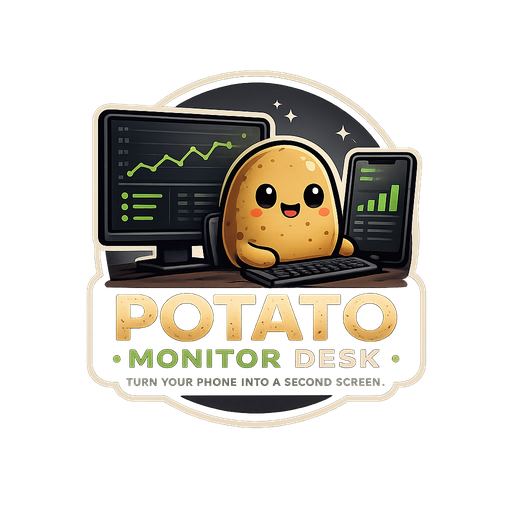

# Potato Monitor Desk



Preview layar + suara PC ke HP Android lewat kabel USB — versi ringan ala
spacedesk, tapi **tanpa driver display virtual** (bukan extend monitor asli,
melainkan mirror/preview layar PC ke HP dengan latensi rendah).

Server berjalan di **system tray** (bukan console), dengan window sederhana:
- Saklar ON/OFF untuk mulai/berhenti streaming.
- Status USB: Terhubung / Tidak terhubung (auto update tiap 2 detik).
- Nama device Android yang sedang konek.
- Menutup window (tombol X) hanya minimize ke tray — app tetap jalan di
  background. Klik kanan icon tray untuk buka lagi atau benar-benar Keluar.

> Catatan: membuat HP benar-benar terdeteksi Windows sebagai monitor kedua
> (extend desktop) butuh Indirect Display Driver kernel-mode yang harus
> disertifikasi Microsoft — di luar scope project ringan ini. Yang dilakukan
> di sini adalah mirror layar+audio real-time, bukan extend display.

Arsitektur:

```
Layar & audio PC (gdigrab + Stereo Mix/VB-Cable)
   -> ffmpeg (encode H.264 + AAC, mux MPEG-TS, output ke stdout)
   -> TsBroadcastServer (Python, port 9999) -- broadcast byte yang sama
      ke semua klien yang connect bersamaan
   -> adb reverse (tunnel lewat kabel USB, otomatis saat device terdeteksi)
   -> Android app, 2 konsumen paralel dari koneksi TCP yang sama:
        a) ExoPlayer (decode + render) -> preview di layar HP
        b) RelayStreamService (demux TS -> RtmpClient) -> RTMP (YouTube dkk),
           TANPA decode/re-encode dan TANPA capture layar HP
```

Poin penting: livestreaming ke YouTube **bukan** hasil merekam layar HP.
HP cuma meneruskan (relay) H.264/AAC yang sudah di-encode PC langsung ke
RTMP. Preview di layar HP (ExoPlayer) itu fitur terpisah buat kamu pantau,
sifatnya opsional — live tetap jalan di background walau app di-minimize.

Project ini punya 2 bagian:

- `server/` — Python, di-build jadi `.exe` + installer Windows.
- `client/` — Android Studio project (Kotlin + Media3 ExoPlayer).

---

## 1. Build Server (Windows)

Sekarang `ffmpeg` dan `adb` **dibundel langsung ke dalam installer** — end
user (termasuk kamu sendiri) tinggal jalankan installer-nya, tidak perlu
install atau atur PATH manual sama sekali. Yang perlu setup manual sekali
hanya di sisi developer (kamu) saat **membangun** installer-nya.

### Prasyarat (hanya untuk build, bukan untuk end-user)
1. Install **Python 3.10+** (centang "Add to PATH" saat install).
2. Download 4 file berikut, taruh di folder `server/bin/` (baca
   `server/bin/PUT_FFMPEG_ADB_HERE.txt` untuk link & detailnya):
   - `ffmpeg.exe`
   - `adb.exe`, `AdbWinApi.dll`, `AdbWinUsbApi.dll`
   File-file ini otomatis ikut ter-bundle ke dalam `.exe` saat build —
   dilakukan **sekali saja**, tidak perlu diulang tiap kali build ulang.
3. Install Inno Setup untuk bikin installer:
   https://jrsoftware.org/isdl.php
4. (Khusus di PC kamu sendiri untuk pakai fitur audio) Aktifkan audio loopback:
   - Klik kanan icon speaker > Sound settings > More sound settings >
     tab Recording > klik kanan area kosong > "Show Disabled Devices" >
     enable **Stereo Mix** (kalau ada).
   - Kalau tidak ada Stereo Mix, install **VB-Audio Virtual Cable** (gratis)
     dan set sebagai default output, lalu pakai itu sebagai `audio_device`.
   > Ini satu-satunya langkah yang memang tidak bisa di-otomatisasi/dibundel,
   > karena tergantung driver audio masing-masing PC.

### Langkah build

```bat
cd server
py -m pip install -r requirements.txt
build_exe.bat
```

`build_exe.bat` otomatis cek dulu apakah `bin\ffmpeg.exe` dan `bin\adb.exe`
sudah ada — kalau belum, akan berhenti dan mengingatkan kamu untuk
menaruhnya dulu sebelum lanjut build.

> **Kalau muncul error `'pip' is not recognized...`**: ini isu umum di installer
> Python versi baru ("Python Install Manager" dari python.org) yang kadang
> tidak menaruh `pip.exe` langsung ke PATH. Selalu pakai `py -m pip ...`
> (bukan `pip ...` langsung) — cara ini selalu berhasil selama `py --version`
> sudah bisa jalan di Command Prompt. Kalau `py` juga belum kedetect, buka
> Command Prompt **baru** (tutup yang lama) supaya PATH ter-refresh setelah
> instalasi Python.

Hasil: `server\dist\PotatoMonitorDeskServer.exe` — file ini **sudah
self-contained** (ffmpeg & adb ada di dalamnya), tidak butuh dependency
eksternal apa pun lagi.

### Build installer

Buka `server\installer.iss` dengan **Inno Setup Compiler**, klik Compile.
Hasil: `Output\PotatoMonitorDeskServerSetup.exe`

Installer ini yang dibagikan ke user (atau dipakai sendiri): Next → Next →
Finish, otomatis membuat shortcut di **Start Menu** dan **Desktop**
(centang "Buat shortcut di Desktop" saat instalasi, sudah tercentang
default), dan begitu dijalankan, ffmpeg & adb sudah langsung siap pakai —
tidak ada lagi dialog "Tidak ditemukan di PATH".

### Sebelum jalan pertama kali — cek nama device audio
Untuk melihat nama persis device audio yang dikenali ffmpeg, buka
Command Prompt lalu jalankan:
```bat
ffmpeg -hide_banner -list_devices true -f dshow -i dummy
```
(pakai `ffmpeg` dari instalasi manapun yang ada di PC kamu untuk sekadar
melihat daftar nama device — tidak harus yang di folder `bin/`).
Cari nama device di bagian **"DirectShow audio devices"** (contoh:
`Stereo Mix (Realtek Audio)` atau `CABLE Output (VB-Audio Virtual Cable)`).
Salin nama itu persis ke `config.json` yang otomatis dibuat di folder
instalasi (sama dengan `PotatoMonitorDeskServer.exe`), di field
`"audio_device"`.

### Isi `config.json`
Dibuat otomatis saat pertama kali dijalankan, berisi:
```json
{
  "audio_device": "Stereo Mix (Realtek Audio)",
  "video_bitrate": "3M",
  "audio_bitrate": "128k",
  "port": 9999,
  "control_port": 9998,
  "resolution": "1280x720",
  "framerate": 30
}
```
`port` untuk stream video+audio (sekarang bisa melayani beberapa koneksi
sekaligus lewat `TsBroadcastServer` — mis. preview + relay live berjalan
bersamaan), `control_port` untuk menerima perintah ganti kualitas dari HP
(lihat bagian "Fitur client" di bawah). `resolution` dan `video_bitrate`
akan otomatis ter-update kalau kamu ganti kualitas dari app Android — tidak
perlu diedit manual kecuali mau atur nilai awal default.

### Menjalankan
1. Sambungkan HP ke PC lewat kabel USB, pastikan USB debugging aktif & sudah
   di-authorize (akan muncul dialog "Allow USB debugging" di HP saat pertama
   kali connect ke PC ini).
2. Jalankan `PotatoMonitorDeskServer.exe`. Window kecil akan muncul:
   - Label **USB** otomatis jadi "Terhubung" + nama device begitu HP terdeteksi
     (adb reverse dipasang otomatis di belakang layar, tidak perlu command manual).
   - Geser **saklar Streaming** ke ON untuk mulai capture layar+audio & kirim
     ke HP. Geser ke OFF untuk berhenti sementara tanpa menutup aplikasi.
3. Tutup window (tombol X) kalau mau app tetap jalan di background — cari
   icon di system tray untuk buka lagi kapan saja, atau klik kanan > Keluar
   untuk benar-benar mematikan aplikasi.
4. Buka app **Potato Monitor Desk** di HP — begitu saklar ON, gambar+suara
   PC langsung tampil di HP.

---

## 2. Build Client (Android)

### Setup signing (sekali saja, sebelum build release)
APK release **wajib** ditandatangani dengan keystore rilis sendiri (bukan
debug key) — APK yang ditandatangani debug key adalah salah satu sinyal
terbesar yang bikin Google Play Protect menganggap app "tidak dikenal/
berisiko" saat sideload. Sudah disiapkan `keystore.properties.example` di
root `client/`:
1. Generate keystore (sekali saja):
   ```bash
   keytool -genkeypair -v -keystore app/release-keystore.jks \
     -alias potato-monitor-desk -keyalg RSA -keysize 2048 -validity 10000
   ```
2. Copy `keystore.properties.example` jadi `keystore.properties`, isi
   password & alias sesuai yang kamu pakai di atas.
3. **Jangan pernah commit** `keystore.properties` atau `*.jks` ke git — sudah
   masuk `.gitignore`, tapi tetap dicek ulang sebelum push kalau baru clone.

Build release APK: `Build > Generate Signed Bundle/APK` di Android Studio,
atau `./gradlew assembleRelease`.

### Langkah build
1. Buka **Android Studio** > Open > pilih folder `client/`.
2. Biarkan Gradle sync selesai (akan download dependency Media3 ExoPlayer +
   Media3 Extractor + RootEncoder, perlu koneksi internet saat build pertama
   kali).
3. Sambungkan HP Android (USB debugging aktif) atau pakai emulator.
4. Klik Run ▶ untuk install & buka app "Potato Monitor Desk" di HP.

App akan otomatis connect ke `127.0.0.1:9999` (diteruskan lewat `adb reverse`
yang dipasang otomatis oleh server) begitu dibuka. Kalau server belum jalan,
tampil status "Menghubungkan..." dan tombol **Reconnect** untuk coba lagi.

---

## Live streaming langsung dari app (relay, tanpa capture layar HP)

Potato Monitor Desk bisa live-streaming tampilan PC langsung ke RTMP —
YouTube Live, Facebook Live, atau server RTMP sendiri. Sejak versi ini,
mekanismenya **bukan** merekam layar HP (tidak pakai `MediaProjection`),
melainkan **relay**: data H.264/AAC yang sudah di-encode di PC (lewat OBS
preview / ffmpeg) di-demux dari MPEG-TS lalu dikirim langsung ke RTMP apa
adanya, tanpa decode dan tanpa re-encode ulang di HP. Ini jauh lebih ringan
untuk HP kelas Android Go (mis. Xiaomi A3) karena tidak ada beban encoding
ganda, dan otomatis tidak akan ke-capture popup notifikasi dari HP — karena
memang tidak ada yang direkam dari layar HP sama sekali.

**Cara pakai:**
1. Buka ⚙ **Pengaturan** > **Pengaturan Live** > isi *Alamat RTMP* (URL
   server + stream key digabung jadi satu, contoh format YouTube:
   `rtmp://a.rtmp.youtube.com/live2/<stream-key>`), pilih posisi timer LIVE
   (kiri/kanan, atas/bawah), lalu Simpan.
2. Nyalakan switch **LIVE** di pojok kanan atas. Tidak ada dialog izin
   capture layar yang muncul — app langsung connect ke stream PC dan mulai
   mem-forward ke RTMP.
3. Live dimulai: badge **🔴 LIVE 00:00:xx** muncul di posisi yang kamu pilih
   dan bertambah setiap detik. Kalau tidak sedang live (cuma mirror layar
   biasa), badge ini otomatis tersembunyi.
4. Matikan switch **LIVE** kapan saja untuk stop stream tanpa menutup app.
   Preview layar (poin 1 di atas) boleh tetap dibuka atau di-minimize —
   dua-duanya jalan independen.

Audio yang terkirim ke live adalah **audio yang sama dengan yang di-capture
di PC** (lewat Stereo Mix/VB-Cable) — bukan mikrofon HP dan bukan audio
internal HP, karena tidak ada proses capture apa pun yang terjadi di HP.

> Catatan teknis: implementasi relay ini pakai `androidx.media3:media3-extractor`
> (`TsExtractor`) untuk demux MPEG-TS jadi access unit mentah, lalu dikirim
> lewat class low-level `com.pedro.rtmp.rtmp.RtmpClient` dari library
> RootEncoder (bukan lewat `RtmpDisplay`/`MediaProjection` seperti versi
> sebelumnya). Server harus bisa melayani 2 koneksi TCP bersamaan di port
> yang sama (lihat `TsBroadcastServer` di server) — satu untuk preview,
> satu untuk relay ini.

---

## Fitur client (HP)

Tekan ikon gear (⚙) di pojok kanan atas saat streaming untuk membuka menu:

- **Kualitas Streaming** — pilih preset resolusi/bitrate (Rendah/Sedang/Tinggi/
  Sangat Tinggi). Perintah dikirim ke server lewat kabel USB (port kontrol
  terpisah, `9998`), server otomatis restart proses ffmpeg dengan setting baru
  — stream di HP akan reconnect sendiri dalam beberapa detik.
- **Aplikasi yang Disunyikan** — daftar semua app terpasang, centang app yang
  notifnya ingin dibungkam SAAT Potato Monitor Desk aktif (mis. WhatsApp,
  Telegram, Instagram). App yang tidak dicentang (mis. app live-streaming
  kamu) tetap tampil notifikasinya seperti biasa.
- **Izin Akses Notifikasi** — wajib diaktifkan sekali (Android mengharuskan
  izin ini diberikan manual lewat Settings, tidak bisa otomatis dari app).
  Tanpa izin ini, fitur "Aplikasi yang Disunyikan" tidak akan bekerja.

**Minimize / Picture-in-Picture**: tombol minimize (pojok kanan atas) atau
tekan tombol Home akan mengecilkan app jadi floating window kecil yang tetap
menampilkan preview sambil kamu buka app lain — bukan benar-benar keluar dari
stream. Untuk keluar total, tutup floating window-nya atau buka lagi lalu
tekan Back.

---

## Catatan & tuning

- **Latensi**: default preset `ultrafast` + `zerolatency` untuk latensi rendah.
  Kalau gambar patah-patah, turunkan `resolution` atau `video_bitrate` di
  `config.json` (mis. `960x540`, bitrate `1.5M`).
- **Kualitas vs kabel**: karena lewat USB (bukan WiFi), throughput jauh lebih
  stabil — aman naikkan bitrate kalau kabel & port USB mendukung.
- **Capture window OBS spesifik** (bukan seluruh layar): ganti input `gdigrab`
  di `build_ffmpeg_cmd()` dari `-i desktop` jadi `-i title=<judul window OBS>`.
- **Multi-device**: saat ini didesain untuk 1 HP per server (satu port TCP
  untuk stream + satu untuk kontrol). Untuk banyak HP sekaligus, jalankan
  beberapa instance server dengan `port`/`control_port` berbeda per instance,
  dan pastikan `adb -s <serial> reverse ...` dipasang untuk device masing-masing.

---

## Logo & icon

Semua aset di bawah sudah digenerate dari `logo.png` (logo utama) dan sudah
otomatis terpakai — tidak perlu diedit manual kecuali mau ganti desain:

- `server/icon.ico` — icon file `.exe`, taskbar, dan shortcut installer.
- `server/icon.png` — dipakai runtime untuk tray icon & title bar window.
- `client/app/src/main/res/mipmap-*/ic_launcher.png` (+ `_round`) — icon app
  di launcher HP, sudah digenerate untuk semua density (mdpi–xxxhdpi).
- `client/app/src/main/res/drawable/potato_logo.png` — ditampilkan di
  `SplashActivity` (splash screen ~1.2 detik) sebelum masuk ke layar utama.

Kalau nanti ganti logo, tinggal replace `logo.png` di root project lalu
generate ulang turunannya (resize ke ukuran yang sama seperti di atas) — atau
minta saya bantu generate ulang.
